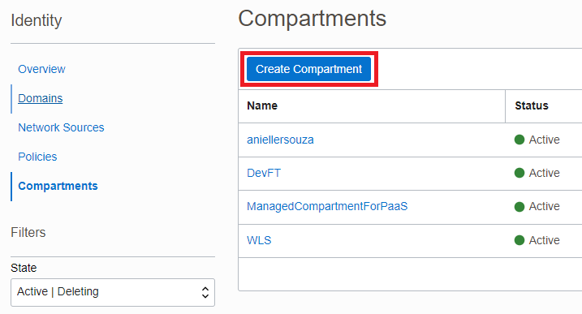
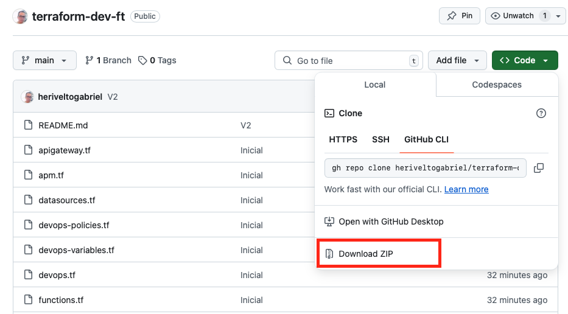
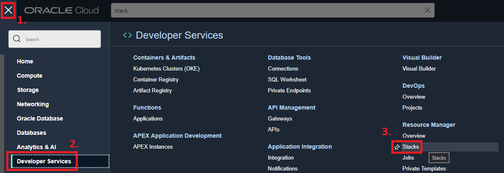
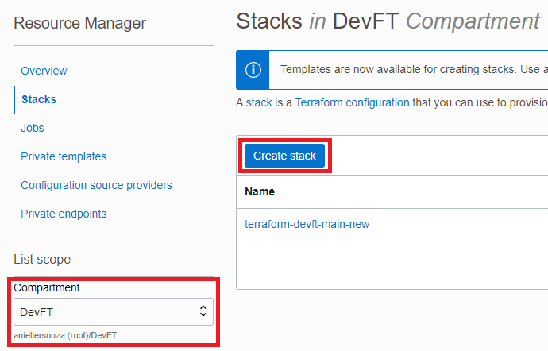
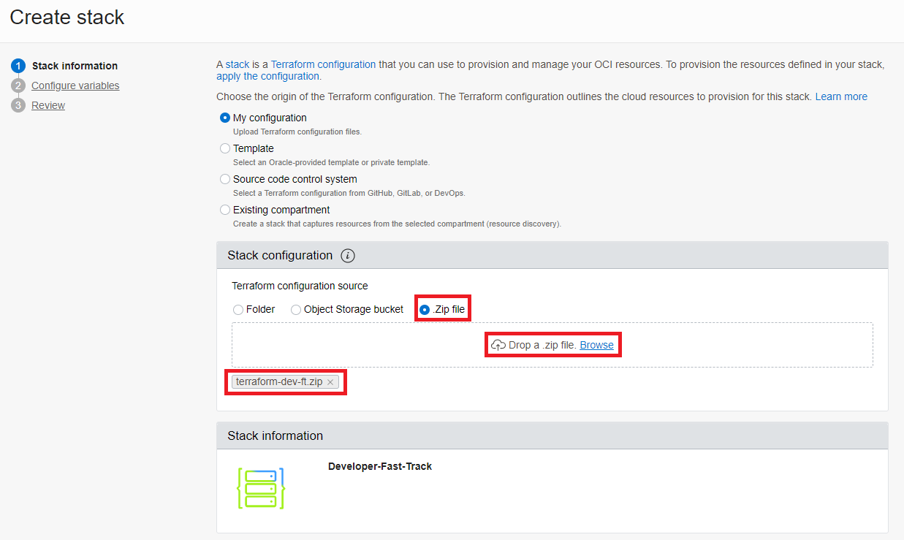
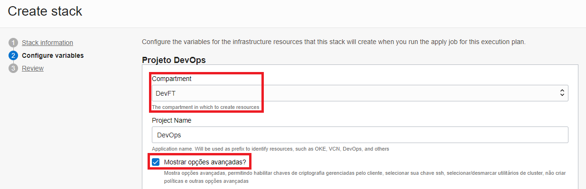
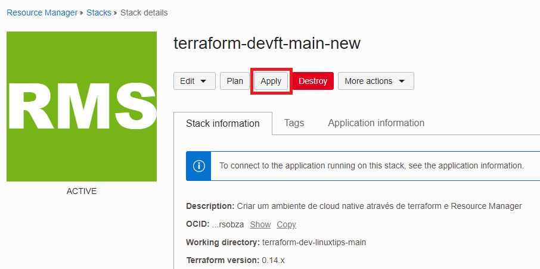

# Lab. 1 - Resource Provisioning  

Nesta etapa, você irá provisionar recursos dentro da OCI utilizando Terraform com o serviço **Resource Manager**!

- 🌀 [Página oficial do Resource Manager](https://www.oracle.com/br/devops/resource-manager/)
- 🧾 [Documentação do Resource Manager](https://docs.oracle.com/pt-br/iaas/Content/ResourceManager/home.htm)

Os recursos provisionados serão:

- OKE
- Artifact Registry
- Container Registry
- OCI DevOps
- APM
- API Gateway
- Streaming
- Object Storage
- Functions

Juntamente com recursos de Rede e Gerenciamento como:

- VCN
- Subnets
- Dynamic Groups
- Policies
- Compartments

- - -

## Pre-Reqs - Criação de compartimento
Como pré-requisito, é uma boa ideia criarmos um compartimento isolado para poder agrupar nossos recursos!

1. Para isso, faça o [login](https://www.oracle.com/cloud/sign-in.html) em sua conta na OCI.

2. No 🍔 menu de hambúrguer, acesse: **Identity & Security** → **Identity** → **Compartments**.

3. Na nova janela, clique em **Create Compartment**.

4. Insira um nome para o compartimento e também uma descrição. Feito isto, clique em **Create Compartment**.

Excelente!!! Podemos agora iniciar com os passos do nosso lab!

- - -

## Passo 1 - Download do repositório

Como primeiro passo, devemos fazer o download do arquivo (zip) no repositório do github.

 1. Para isso, acesse o [repositório](https://github.com/heriveltogabriel/terraform-dev-ft) e clique em **Download ZIP**.
  

- - -

## Passo 2 - Upload do terraform no Resource Manager

1. Faça o [login](https://www.oracle.com/cloud/sign-in.html) em sua conta na OCI.

2. No 🍔 menu de hambúrguer, acesse: **Developer Services** → **Resource Manager** → **Stacks**.

3. Nesta nova janela, acesse o compartment criado previamente e clique em **Create Stack**.

4. Selecione a opção "Zip file", clique em "browse" e arraste o arquivo (.zip), que contém os arquivos .tf. O Resource Manager irá preencher todos os campos.

5. Clique em **Next**, para podermos configurar alguns parâmetros sobre os recursos a serem provisionados.

6. Nesta nova tela, lembre-se de selecionar o compartment criado previamente e clicar em **Mostrar opções avançadas**.

7. Antes de prosseguir, lembre-se de selecionar a versão "v1.25.4" na opção **Kubernetes Version**.

8. Clique em **Next**.

9. Criada nossa stack, clique em **Apply** e confirme a ação.

10. O provisionamento dos recursos deverá durar em torno de 25 minutos.

11. Após finalizar o Apply com sucesso, podemos conferir o provisionamento dos nossos recursos!

### ✔ Ambientes provisionados com sucesso!!! Você provisionou recursos usando Terraform na OCI! 🚀

### [Continua... LAB02 --> ](tree/main/Lab.%20%231%20-%20Resource%20Provisioning/LAB02) 