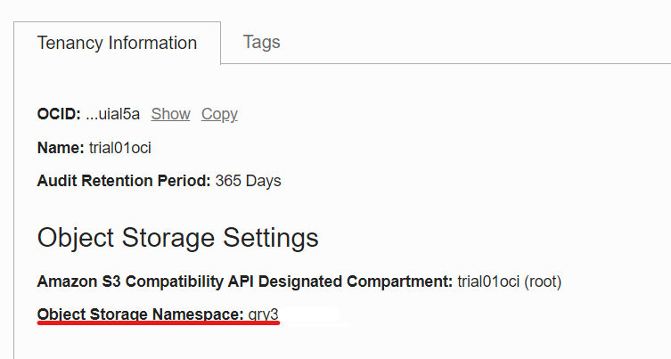

# Lab 2 - Collect Tenancy information

Laboratório para coletar as informações do Tenanancy, Usuário, Token e etc. 


- [Lab 2 - Developing Cloud Native Applications - Parte 1](#lab-2---developing-cloud-native-applications---parte-1)
  - [Objectivo](#objectivo)
  - [Coleta de Informações](#coleta-de-informações)
    - [Tenancy Namespace](#tenancy-namespace)
    - [User OCID & Auth Token](#user-ocid--auth-token)
    - [Dados do APM](#dados-do-apm)
    - [Código da Região](#código-da-região)

## Coleta de Informações

Vamos coletar algumas informações na tenancy do OCI que serão utilizadas ao logo do laboratório, recomendamos que as anote em um bloco de nota para ter sempre em mãos de modo fácil. Serão coletadas as seguintes informações:

```bash
Tenancy Namespace:
User Name:
Auth Token:
APM Endpoint:
Public Key:
Código da Região:
```

### Tenancy Namespace

Clique no menu do lado direto no icone do usuário, clique no nome da sua tenency.


Agora copie o namespace para o bloco de notas.



### User OCID & Auth Token

Clique no menu do lado direto no icone do usuário, clique no nome do seu usuário.


Copie o OCID do usuário e salve no bloco de notas.

Depois, vá em Auth Tokens e gere um novo token, salve o token no bloco de notas.


### Dados do APM

Navegue no menu principal em Observability & Management > Application Monitoring> Administration

Clique no domínio criado pelo Resource Manager no laboratório anterior, e copie os dados do Endpoint e da Public Key.


### Código da Região

Você pode pesquiar o código da sua região [aqui](https://docs.oracle.com/en-us/iaas/Content/Registry/Concepts/registryprerequisites.htm#regional-availability)


### [Continua no Lab. #2 --> ](../../Lab.%20#2%20-%20Developing%20Cloud%20Native%20Applications/) 