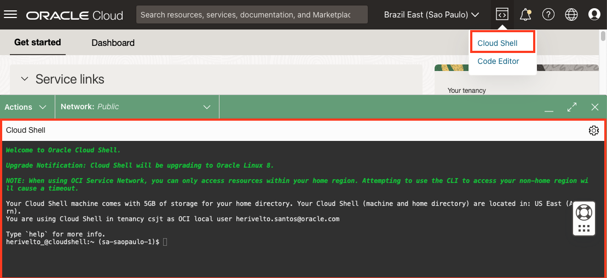
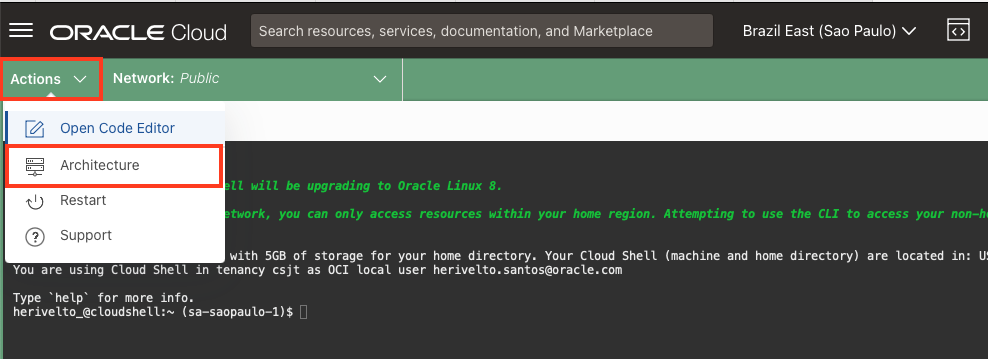
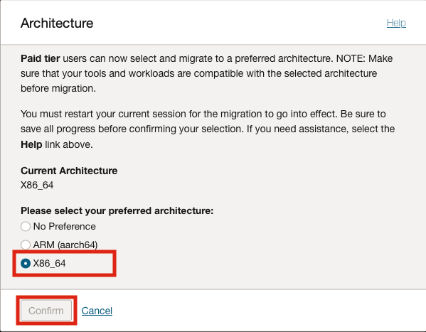

# LAB01 - Deploying Backend

Laboratório para mostrar na prática o funcionamento das ferramentas de developer no OCI.
Criar uma aplicação no Kubernetes com as imagens de container armazenadas no Oracle Container Registry (OCIR). 
O backend da aplicação será exposto através do API Gateway, onde receberá os headers de CORS necessários para se comunicar com o frontend.

## Objetivo
Configurar o Docker Login, gerar imagem do back-end e enviar para o registry do OCI. 
Acessar o cluster Kubernetes e fazer o deploy do Back-end 
Além disso a aplicação já contará com as bibliotecas e configurações necessárias para ser monitorada pelo APM.

- [Lab 2 - Developing Backend]
  - [Abrir Cloud Shell](#abrir-cloud-shell)
    - [Cloud Shell Arquitetura](#cloud-shell-arquitetura)
  - [Configurar o Docker](#docker-config)
    - [Docker Imagem](#docker-imagem)
    - [Docker TAG](#docker-tag)
    - [Docker Login](#docker-login)
    - [Docker Push](#docker-push)
  
  - [Configurar o Kubectl](#configurar-o-kubectl)
    - [Copiar o Código](#copiar-o-código)
    - [Criando Secret no Kubernetes](#criando-secret-no-kubernetes)
    - [Configurar o Manifesto de Kubernetes](#configurar-o-manifesto-de-kubernetes)
    - [Deploy no Kubernetes](#deploy-no-kubernetes)

  - [Configuração API Gateway](#configuração-api-gateway)
    - [Deployment](#deployment)
  

## Abrir Cloud Shell
Abra o **Cloud Shell** na barra superior do OCI, clique no icone e selecione a opção "Cloud Shell"



## Abrir Cloud Shell
Abra no **Cloud Shell** o menu <b>Actions->Architecture</b> e confirme se a arquitetura está em <b>X86_64</b> Se não estiver, mude e confirme. 





## Docker Config

## Docker imagem 
Vamos baixar a imagem do Docker HUB, fazer o Tag e subir para o Container Registry do OCI. 

```bash
docker pull heriveltogabriel/backend
```

## Docker TAG
Vamos remomear a imagem para o padão do OCI 

```bash
docker image tag heriveltogabriel/backend:latest  <Codigo Region>.ocir.io/<tenancy-namespace>/backend:latest
```

## Docker Login

Vamos precisar do Docker para fazer o build dos containers da aplicação e fazer o push para o OCIR. Antes do push, precisamos nos logar no OCIR através do dorcker-CLI.

No **Cloud Shell** e execute o comando abaixo substituindo o username, tenanacy ocid e código da região. E na senha utilize o Auth Token gerado anteriormente.

```bash
docker login <Codigo Region>.ocir.io -u <tenancy-namespace>/<username>
```

Resultado:

```bash
password: <Auth Token>
WARNING! Your password will be stored unencrypted in /home/trial01oci/.docker/config.json.
Configure a credential helper to remove this warning. See
https://docs.docker.com/engine/reference/commandline/login/#credentials-store
```


### Docker Push

Depois da Build vamos fazer o push para o OCIR

```bash
docker push <Codigo Region>.ocir.io/<tenancy-namespace>/backend
```


##
## Configurar o Kubectl

Agora vamos configurar o acesso ao Kubernetes via Kubectl no Cloud Shell, no menu principal vá em **Developer Services > Containers & Artifacts > Kubernetes Clusters (OKE)**.

Entre no cluster criado via Resource manager e clique no botão **Access Cluster**


Copie o comando que aparece no popup e execute no cloud shell.

Exemplo:

```bash
$ oci ce cluster create-kubeconfig --cluster-id ocid1.cluster.oc1.sa-saopaulo-1.aaaaaaaan2pf --file $HOME/.kube/config --region sa-saopaulo-1 --token-version 2.0.0  --kube-endpoint PUBLIC_ENDPOINT

New config written to the Kubeconfig file /home/trial01oci/.kube/config

```

O acesso pode ser testado com o seguinte comando:

```bash
kubectl get nodes
```

Deve ter uma resposta parecida com essa:

```bash
NAME           STATUS   ROLES   AGE     VERSION
10.20.10.125   Ready    node    3h23m   v1.21.5
10.20.10.138   Ready    node    3h23m   v1.21.5
10.20.10.208   Ready    node    3h23m   v1.21.5
```

### Criando Secret no Kubernetes

Vamos criar um secret que irá conter as informações do login do OCIR. Permitindo assim que seja feito o pulling das images.

Basta executar esse código, substituindo os valores

```bash
kubectl create secret docker-registry ocisecret --docker-server=<region-key>.ocir.io --docker-username='<tenancy-namespace>/<oci-username>' --docker-password='<oci-auth-token>' --docker-email='<email-address>'
````

Resposta:

```bash
secret/ocisecret created
```

### Configurar o Manifesto de Kubernetes

Vamos agora voltar uma pasta:

```bash
cd ..
```

Editar o código para adicionar os parametros do APM e da imagem:

```bash
vi Deploybackend.yaml
```

Pressione **i** para editar.

Substitua os valores de **Image-Name**, **Endpoint do APM** e **Key do APM** nas seguites linhas:

```note
Image-Name = <Codigo Region>.ocir.io/<tenancy-namespace>/backend```

```yaml
      - name: backend
        image: [Image-Name]:latest
        imagePullPolicy: Always
        ports:
        - containerPort: 5000
        env:
        - name: APM_URL
          value: "[Substitua pelo Endpoint do APM]"
        - name: APM_KEY
          value: "[Substitua pela Public Key do APM]"
```

Após substituir os valores utilize os seguintes comando **ESC : WQ** e pressione Enter.

### Deploy no Kubernetes

Com o arquivo editado podemos executar o seguinte comando para realizar o deploy:

```bash
kubectl apply -f Deploybackend.yaml
```

Deve ter uma saida como a seguinte:

```bash
deployment.apps/cepapp-backend created
service/cepapp-backend created
```

Podemos usar o seguinte código para saber se os pods já estão no ar:

```bash
kubectl get pods
```


##
## Configuração API Gateway

Primeiro precisamos descobrir o IP do **Load Balancer** do serviço do backend.

```bash
kubectl get svc cepapp-backend
```

A resposta será parecida com essa:

```bash
NAME             TYPE           CLUSTER-IP      EXTERNAL-IP    PORT(S)          AGE
cepapp-backend   LoadBalancer   10.96.123.143   10.20.20.237   5000:31952/TCP   13m
```

Vamos utilizar o EXTERNAL-IP para realizar expor-lo através do **API Gateway**.

Agora vamos navegar no menu principal **Developer Services > API Management > Gateways**. E selecionar o gateway já criado pelo Resource Manager. No menu do lado esquerdo vamos em Deploymets.


E agora vamos criar um novo deployment, que conterá a rota do backend que será consumida pelo frontend.

### Deployment

Preencha as informações básicas com os sequintes dados:

- **Name**: backend
- **PATH PREFIX**: /cep
- **Compartment**: Selecione seu compartimento.


Agora vamos preencher as informações de **CORS**, sem elas vamos ter erros nas chamadas entre o Frontend e o Backend.

Na região do CORS clique no botão add e preencha os seguintes campos:

- **ALLOWED ORIGINS**: *
- **Methods**: GET

E aplique as modificações.


Com o CORS configurado, podemos clicar em **Next** e configurar a rota. Vamos preencher os campos da Rota1 da seguinte forma:

- **PATH**: /getcep
- **METHODS**: GET
- **TYPE**: HTTP
- **URL**: ```http://[External-IP-do-LoadBalancer]:5000```


Depois de preenchido clique em **Next** e depois **Create**.

Quando a criação do Deployment estiver concluida, copie o URL do endpoint e teste a rota.


Basta jogar o endpoint no navegador, no seguinte formato:

```bash
<seu_endpoint>/getcep?cep=<cep-da-sua-casa>
```


### 
[Continua... --> ](../LAB02/) 
