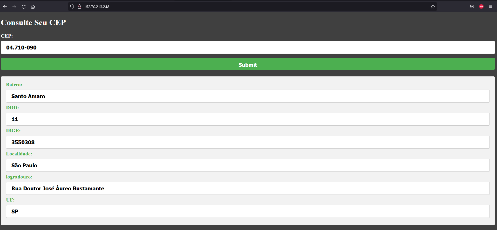

# LAB02 - FRONT-END

Laboratório para mostrar na prática o funcionamento das ferramentas de developer no OCI.
Criar uma aplicação no Kubernetes com as imagens de container armazenadas no Oracle Container Registry (OCIR). 
O backend da aplicação será exposto através do API Gateway, onde receberá os headers de CORS necessários para se comunicar com o frontend.

## Objetivo
Configurar e gerar imagem do front-end e enviar para o registry do OCI. 
Acessar o cluster Kubernetes e fazer o deploy do Front-End.
Testar a Aplicação.

- [Lab 2 - Developing FRONT-END](#lab-2---developing-cloud-native-applications---parte-1)
  - [Configurar e fazer Deploy do Frontend](#configurar-e-fazer-deploy-do-frontend)
    - [Configurando o Frontend](#configurando-o-frontend)
    - [Docker Build Front](#docker-build-front)
    - [Docker Push Front](#docker-push-front)
    - [Configurar o Manifesto do Kubernetes](#configurar-o-manifesto-do-kubernetes)
    - [Deploy do Front no Kubernetes](#deploy-do-front-no-kubernetes)
  - [Testando a Aplicação](#testando-a-aplicação)


## Configurar e fazer Deploy do Frontend

Para o Frontend precisamos substituir o URL do backend e as informações do APM antes de fazer a build do Docker.

### Configurando o Frontend

Vamos navegar até a pasta do javascript:

```bash
cd $HOME/labcodeappdev/Frontend/code/js
```

E editar o arquivo **api.js**

```bash
vi api.js
```

Vamos substituir a variável url.

```js
const url = '[Substituia com a URL do API Gateway]'
```

Para isso pressione **i** para editar o arquivo substitua as informações dentro das aspas.

```js
const url = 'https://ghstpnks2qut3htj2w7zmdtghi.apigateway.sa-saopaulo-1.oci.customer-oci.com/cep/getcep'
```

Para salvar use as teclas **ESC : WQ** .

Agora precisamos configurar o APM no HTML, vamos voltar uma pasta:

```bash
cd ..
```

E editar o arquivo **index.html**:

```bash
vi index.html
```

E substituir os valores nas seguintes linhas:

```html
<script>
  window.apmrum = (window.apmrum || {}); 
  window.apmrum.serviceName='CEP';
  window.apmrum.webApplication='cepapp';
  window.apmrum.ociDataUploadEndpoint='[Substitua com o Endpoint do APM]';
  window.apmrum.OracleAPMPublicDataKey='[Substitua com a Public Key do APM]';
</script>
<script async crossorigin="anonymous" src="[Substitua com o Endpoint do APM]/static/jslib/apmrum.min.js"></script>
```

Salve o arquivo.

### Docker Build Front

Após, configurar o frontend, vamos realizar a build do docker com o seguinte comando.

```bash
docker build -t <Codigo Region>.ocir.io/<tenancy-namespace>/front .
```

### Docker Push Front

Ao final da build podemos fazer o push para o OCIR

```bash
docker push <Codigo Region>.ocir.io/<tenancy-namespace>/front
```

### Configurar o Manifesto do Kubernetes

Agora precisamos voltar mais uma pasta:

```bash
cd ..
```

E editar o arquivo Deployfrontend.yaml:

```bash
vi Deployfrontend.yaml
```

 Pressione **i** para editar o arquivo, e substitua a **Image-Name**:

 ```note
Image-Name = <Codigo Region>.ocir.io/<tenancy-namespace>/ftdeveloper/front
```

 ```yaml
     spec:
      containers:
      - name: front
        image: [Image-Name]:latest
        imagePullPolicy: Always
        ports:
        - containerPort: 80
      imagePullSecrets:
```

Após a alteração salve o arquivo com **ESC : WQ**.

### Deploy do Front no Kubernetes

Agora vamos executar o deploy do frontend no Kubernetes com o seguinte comando:

```bash
kubectl apply -f Deployfrontend.yaml
```

Resultado:

```bash
deployment.apps/cepapp-front created
service/cepapp-front created
```

## Testando a Aplicação

Agora com o deploy do frontend e do backend podemos testar a aplicação.

Vamos obter o IP do Load Balancer do Frontend para acessar a aplicação:

```bash
kubectl get svc cepapp-front
```

Obtendo um resultado parecido com esse:

```bash
NAME           TYPE           CLUSTER-IP     EXTERNAL-IP      PORT(S)        AGE
cepapp-front   LoadBalancer   10.96.188.10   152.70.213.248   80:31117/TCP   89s
```

Basta copiar o IP externo no navegador e testar se aplicação retorna as informações.


