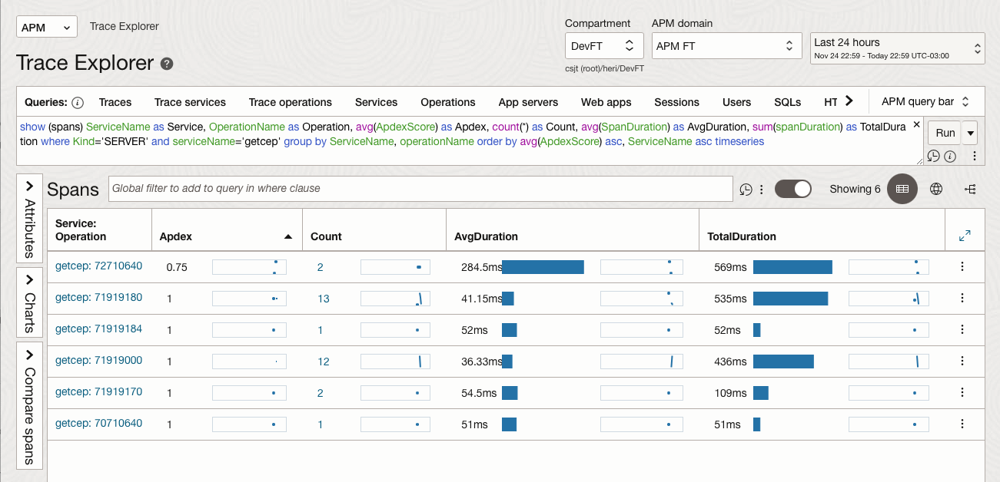

# APM Monitoring 
<b> Observabilidade </b> - Nesse lab veremos a monitoração adicionada ao Frontend via javascript, verificando os dashboards e dados coletados pela ferramenta. 

## Navegue nos menus <b>"Observability & Management -> Application Performance Monitoring -> Home"</b>

Navegue nos Dashboards, itens, menus e vejam as informações geradas pelo o uso da aplicação. 

